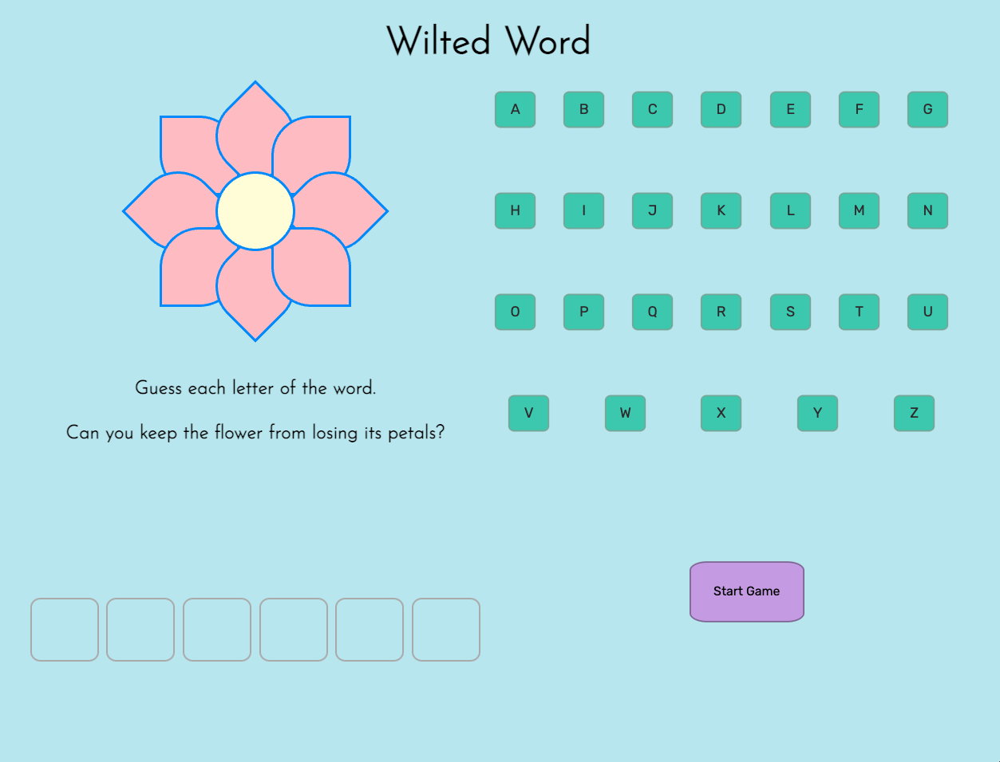
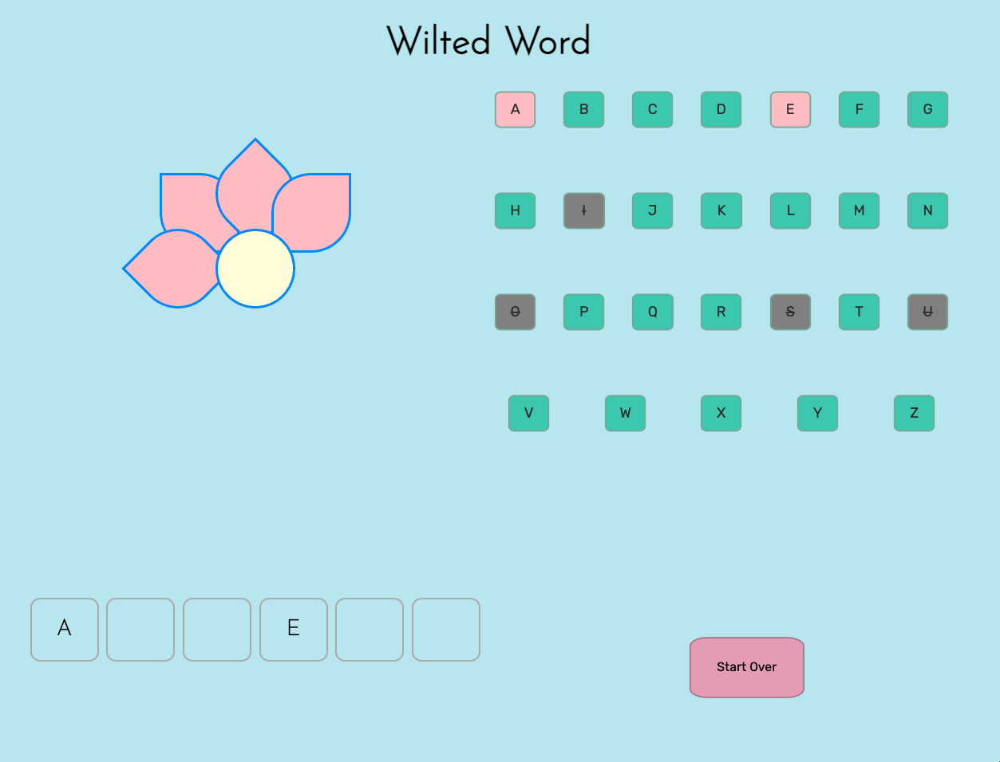
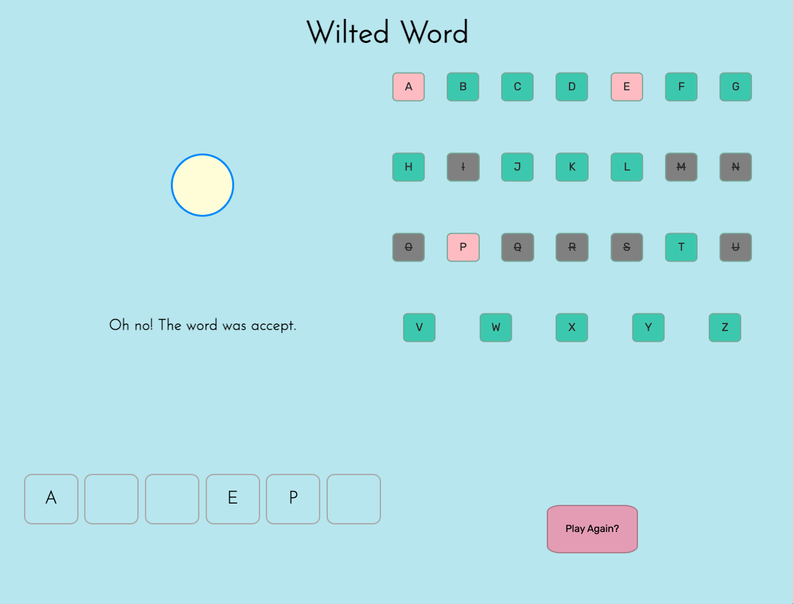

# Wilted Word

Wilted Word is a reimagining of the game hangman. The objective of the game is to guess the six-letter word without losing all the petals on the flower.

## Preview

## Getting Started

https://egwilborn.github.io/browser-game-project/

To play the game, click the start game button. Then click on any letter that you think might be in the word. If you get the letter right, you can see where in the word it is! If you don’t guess correctly, the flower loses a petal. If you guess incorrectly more than eight times, the game is lost!

### Technologies Used:

This game was made using HTML, CSS and JavaScript.

## Next Steps

-Add functionality to allow the player to use their keyboard to guess a letter

-Add a two player mode where someone can input a word the other player has to guess

-Expand the word options from only six letters to 5-8 letter words and adjust the petals accordingly
